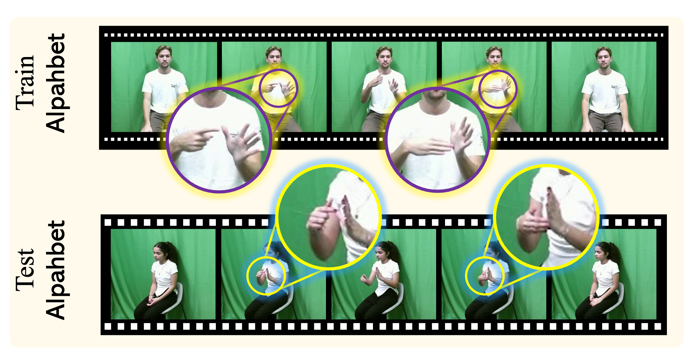
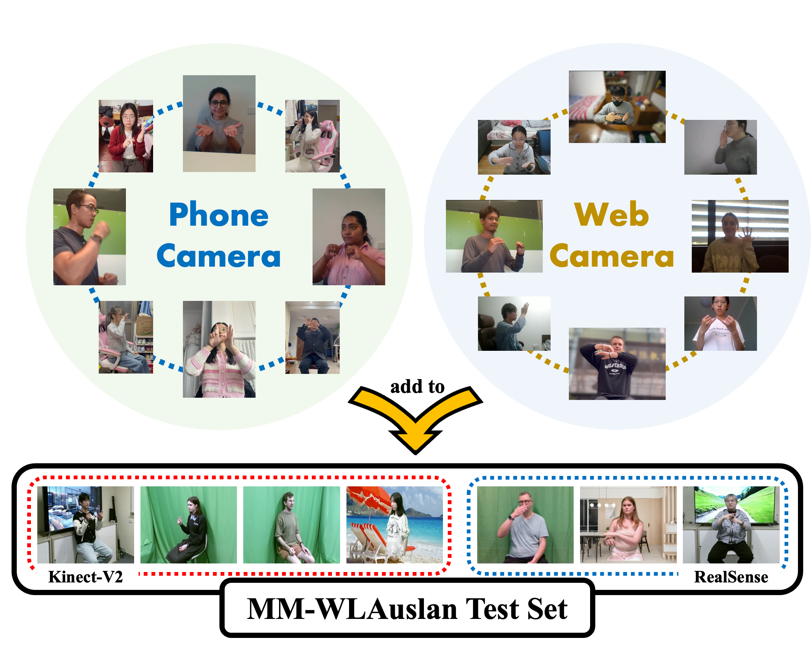
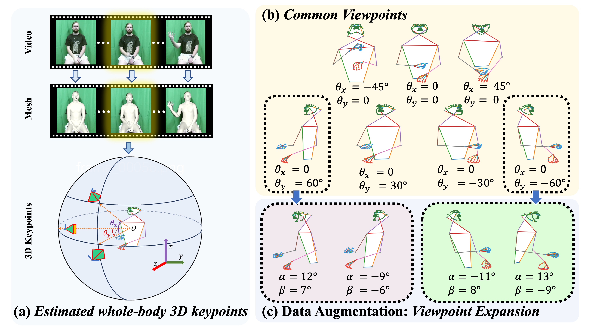

<h3 align="center"><a href="" style="color:#9C276A">
Cross-View Isolated Sign Language Recognition via View Synthesis and Feature Disentanglement</a></h3>
<h5 align="center"> 
If our project helps you, please give us a star🌟 on GitHub, that would motivate us a lot!
</h2>

## The challenges of CV-ISLR task.
Demonstration of the viewpoint discrepancy in Cross-View Isolated Sign Language Recognition (CV-ISLR), where the top row shows a training ''alphabet'' sample and the bottom row illustrates a testing ''alphabet'' sample captured from a different perspective. 
The highlighted areas emphasize challenges such as self-occlusion and hand shape variations.

## 💥 News
[2025/6/26] This [paper]() is accepted by `ICCV 2025` 🎉🎉!

  
## Multi-View Test set (MTV-Test).
MM-WLAuslan is currently the only dataset designed explicitly for Cross-View Isolated Sign Language Recognition (CV-ISLR). 
In contrast to traditional ISLR datasets—often restricted to a single viewpoint—MM-WLAuslan provides multiple test subsets, which allow benchmarking under various constraints. 
However, these subsets mostly involve small yaw angles and predominantly rely on controlled sensor environments, limiting their ability to reflect broader real-world complexity. 
Additionally, the use of specialized RGB-D devices does not fully emulate the ubiquitous consumer-grade cameras found in daily life scenarios.
         
To address these gaps, we propose **MTV-Test**, a test set that substantially extends cross-view and environmental diversity beyond what is currently offered by MM-WLAuslan. 
We recruit 30 participants, including Auslan experts, Deaf signers, and volunteers, ensuring a wide range of signing styles. 
Each participant is instructed on recommended camera angles, gloss lists, and recording procedures. 
Unlike MM-WLAuslan's reliance on RGB-D sensors, our data is collected using consumer-grade devices such as smartphones (e.g., iPhone and Samsung) and webcams (e.g., Logitech C922 Pro), aligning with real-world usage scenarios.
We show some data samples in **./MTV_Test** folder.

## Our proposed two-stage framework.
A promising strategy for CV-ISLR involves synthesizing multi-view data from frontal-view videos, allowing models to learn from a more diverse set of camera angles. 
Nevertheless, we observe that directly training on synthetic multi-view samples yields limited gains, as models tend to encode viewpoint-dependent cues rather than genuinely view-invariant representations. 
To overcome these challenges, we propose a two-stage framework composed of View Synthesis and Contrastive Multi-task View-Semantics Recognition.

### View Synthesis
In the View Synthesis stage, we extract 3D whole-body keypoints from frontal-view training data using methods such as SMPL-X-based models or image-based regression techniques. 
Then, instead of synthesizing multi-view RGB videos, we focus on 2D skeleton sequences that are more efficient to process and less sensitive to background and lighting variations.
Specifically, we rotate a virtual camera to diverse yaw and pitch angles and apply perspective transforms to project the 3D keypoints into their corresponding 2D skeletons. 
This strategy significantly enriches the training data with various viewing directions without the need for expensive multi-camera setups.

### Contrastive Multi-task View-Semantics Recognition

In the Multi-task View-Semantics Recognition stage, our goal is to train robust models on the synthesized multi-view sign data by disentangling viewpoint-specific and semantics-specific features.
First, we utilize a cross-attention mechanism to separate viewpoint and semantic information from entangled sign language embeddings. 
Concretely, we construct triplets of skeleton samples: two sequences that share the same sign semantics but differ in viewpoint, paired with a third sequence that shares the viewpoint but represents different semantics.
Then, we employ a multi-task learning framework that simultaneously predicts sign semantics and viewpoint angles. 
This design ensures that viewpoint features are treated as a distinct learning objective instead of being inadvertently entangled in the sign classification pathway. 
Finally, we apply contrastive learning objectives that align embeddings of similar viewpoints or semantics while separating mismatched ones. 
Our approach encourages the model to learn truly view-invariant sign representations, thereby improving generalization to unseen camera angles.

